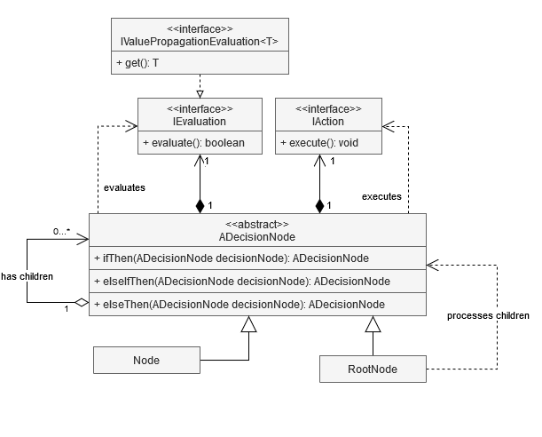

[](https://maven-badges-generator.herokuapp.com/maven-central/classic/com.github.hasatori/decision-tree)
# decision-tree
This tool allows you to create decision tree in order to simplify long sequences of conditions.

### Maven:
```
<dependency>
    <groupId>com.github.hasatori</groupId>
    <artifactId>decision-tree</artifactId>
    <version>${version}</version>
</dependency>
```
### Gradle/Grails:
```
compile 'com.github.hasatori:decision-tree:${version}'
```
### Groovy grape:
```
@Grapes( 
@Grab(group='com.github.hasatori', module='decision-tree', version='${version}') 
)
```
### Apache Buildr:
```
'com.github.hasatori:decision-tree:jar:${version}'
```
### Architecture:


### Examples:
Imagine you have very complex set of nested conditions. Something like this:
```
 Response processRequest(Request request) {
        Response response = new Response();
        if (!isEmpty(request.getAccountNumber())) {
            if ((BASIC_EXECUTABLE_ACCOUNT_NUMBERS.contains(request.getAccountNumber()) && request.getCurrencyType().equals("EU")) || request.getCurrencyType().equals("CZK")) {
                Country country = countryDao.fetchCountryByIdentifiactor(request.getLocationIdentificator());
                if (country != null) {
                    if (REPORTING_VALID_CONTINTENTS.contains(country.getContitent())) {
                        response.setCountry(country);
                    } else {
                        log.warn("Country not valid for reporting");
                    }
                } else {
                    country = countryDao.fetchCountryByAccountNumber(request.getAccountNumber());
                    if (country != null) {
                        response.setCountry(country);
                    } else {
                        log.error("No country found");
                    }
                }
            } else if (R010_EXECUTABLE_ACCOUNT_NUMBERS.contains(request.getAccountNumber())) {
                Country country = countryDao.fetchCountryByIdentifiactor(request.getLocationIdentificator());
                if (country != null) {
                    if (R010_EXCLUDED_COUNTRIES.contains(country.getName())) {
                        response.setExcludedResidency(country);
                        response.setFlag(Flag.EXCLUDED);
                    } else {

                    }
                    if (REPORTING_VALID_CONTINTENTS.contains(country.getContitent())) {
                        response.setCountry(country);
                    } else {
                        log.warn("Country not valid for reporting");
                    }
                } else {
                    log.error("No country found");
                }
            }
        } else if (!isEmpty(request.getIndenticationCode())) {
            Country country = countryDao.fetchCountryByIdentifiactorAndIdentificatior(request.getLocationIdentificator(), request.getIndenticationCode());
            if (country != null) {
                response.setFlag(Flag.CODE_BASED);
                response.setCountry(country);
            } else {
                log.error("No country found");
            }
        }
        return response;
    }

```
As you can see it is very hard to read, a lot of part are kind of similar but no exactly. It is very hard to maintain and read such structure. And this is just a tip of the iceberg of what crazy nested structures might exist in real code.
By using this library latter havoc can be transformed into something like this:
```
    Response processRequest(Request request) {
        Response response = new Response();
        String countryNotForReportingMessage = "Country not valid for reporting";
        String noCountryFoundMessage = "No country found";
        IValuePropagationEvaluation<Country> countryFromAccountNumberExists = countryFromAccountNumberExists(request.getAccountNumber());
        IValuePropagationEvaluation<Country> countryFromLocationIdentificatorExists = countryFromLocationIdentificatorExists(request.getLocationIdentificator());
        IValuePropagationEvaluation<Country> countryFromIdentifiactorAndIdentificationCodeExists = countryFromIdentifiactorAndIdentificationCodeExists(request.getLocationIdentificator(), request.getIndenticationCode());
        root()
                .ifThen(decide(isNotNull(request.getAccountNumber()), doNothing())
                        .ifThen(decide(or(and(anyMatch(request.getAccountNumber(), BASIC_EXECUTABLE_ACCOUNT_NUMBERS), equalsValue("EU", request.getCurrencyType())), equalsValue("CZK", request.getCurrencyType())), doNothing())
                                .ifThen(decide(countryFromAccountNumberExists, doNothing())
                                        .ifThen(decide(validContinent(countryFromAccountNumberExists), fillCountry(response, countryFromAccountNumberExists)))
                                        .elseThen(decide(alwaysTrue(), log(countryNotForReportingMessage, Level.WARN)))
                                        .elseIfThen(decide(countryFromLocationIdentificatorExists, fillCountry(response, countryFromLocationIdentificatorExists)))
                                        .elseThen(decide(alwaysTrue(), log(noCountryFoundMessage, Level.ERROR)))))
                        .elseIfThen(decide(anyMatch(request.getAccountNumber(), R010_EXECUTABLE_ACCOUNT_NUMBERS), doNothing())
                                .ifThen(decide(countryFromLocationIdentificatorExists(request.getLocationIdentificator()), doNothing())
                                        .ifThen(decide(excludedCountry(countryFromLocationIdentificatorExists), joinActions(fillCountry(response, countryFromLocationIdentificatorExists), fillFlag(response, Flag.EXCLUDED))))
                                        .elseThen(decide(alwaysTrue(), doNothing()))
                                        .ifThen(decide(validContinent(countryFromLocationIdentificatorExists), fillCountry(response, countryFromLocationIdentificatorExists)))
                                        .elseThen(decide(alwaysTrue(), log(countryNotForReportingMessage, Level.WARN))))
                                .elseThen(decide(alwaysTrue(), log(noCountryFoundMessage, Level.ERROR)))))
                .elseIfThen(decide(isNotBlank(request.getIndenticationCode()), doNothing())
                        .ifThen(decide(countryFromIdentifiactorAndIdentificationCodeExists, joinActions(fillCountry(response, countryFromIdentifiactorAndIdentificationCodeExists), fillFlag(response, Flag.CODE_BASED))))
                        .elseThen(decide(alwaysTrue(), log(noCountryFoundMessage, Level.ERROR))))
                .elseThen(decide(alwaysTrue(), log("No conditions fulfilled", Level.ERROR)))
                .process();
    return response;
    }
```
It is not only easier to read, but it is also more reusable. It can be even better than this. For long evaluation you do not need to use or or and, you can just create your own evaluation properly named, so that it is easy to understand and can be reused.
